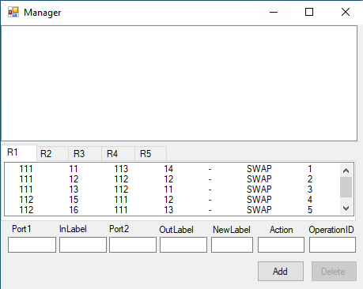
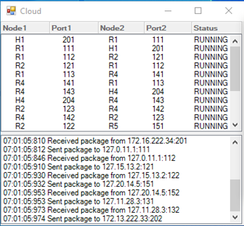
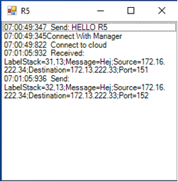
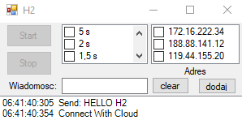

# NetworkMplsEmulator
Jest to emulator sieci posiadający 4 osobne komponenty takie jak Menadzer,Chmura kablowa, Host oraz Router.

Zadaniem menadzera jest ustawienie tablic kierowania pakietów w routerach po uruchomianiu emulatora.

Chmura kablowa odpowiada za wszystkie połączenia między routerami oraz między routerami a hostami.

Działanie routera polega na odebraniu pakietu i przekierowaniu go na odpowiedni port wyjściowy.

Host ma za zadanie odebranie lub wysłanie wiadomości do innego hosta.

